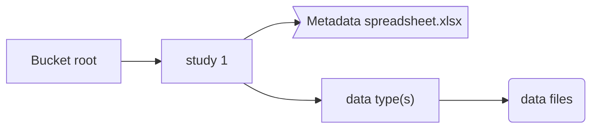

# MorPhiC Metadata Schema

This repository contains a modified version of the Human Cell Atlas Metadata Schema, obtained from their repository.

This is a tentative first approach at metadata standardisation and validation for the MorPhiC consortia.

As such, it will be constantly evolving and adapting to the community needs.

Feel free to [open an issue!](https://github.com/morphic-bio/metadata-schema/issues/new)

# Metadata model

For the metadata model, we suggest a similar approach to the Human Cell Atlas; i.e.defining each step of the experimental process as a separate entity and linking all the entities together to form an experimental graph. With this model, any step in the experiment (e.g. sequence file `​​GT22_04578_R1.fastq.gz`) can lead the user through the experiment, extracting the important metadata in the process of reconstructing the assay.

The suggested metadata model is comprised of 3 main types of information:

**General information about the project**
- Attributes: a unique identifier, a description, institutions involved, etc.
- Use: To be displayed on a catalogue or the data portal when available

**Information of scientific value for each of the samples (sample metadata)**
- Attributes: age of the donor, type of gene expression alteration, etc.
- Use: To be displayed as filters on the data portal when available, collected in a standardised way so that analysis/data collection tools can be developed over the MorPhiC collection of data.

**Information about the data files (file metadata)**
- Attributes: file name, content of the file, description, read index (In the case of RNA-Seq experiments), etc
- Use: allows analysis, quality control filters and helps develop standardised analysis workflows with little to none manual input.

Alongside the metadata model, we are also trying to understand and organise the data model, by organising each of the entities described into a graph that can be parsed, understood and visualised.

## Transcriptomics

# Adaptations HCA --> Morphic

## Technical changes
- "describedBy" fields to point out to github raw instead of the bucket deployment of HCA schemas

## Schema changelog

E = Entity

F = Field

### Project

**Added**
- `project.target_genes` (F)

**Deleted**
- `project.estimated_cell_count` (F)
- `project.publications.official_hca_publication` (F)

### Cell line
**Added**
- `cell_line.genbank_assembly_accession` (F)

### Protocols
**Added**
- `type/protocol/biomaterial_collection/gene_silencing_protocol.json` (E)
- `module/protocol/crisproff.json` (E)

### Ontology

**Added**
- `module/ontology/target_gene_ontology.json` (E)
- `module/ontology/gene_silencing_method_ontology.json` (E)

# MVP data model for buckets

It is a very simplified data model used to deliver an effectively understandable MVP.

The metadata spreadsheet contains the necessary metadata to understand the data within the bucket.

Data files within each of the data type folders don't have a specific ordering or hierarchy; However, the full paths to 
the files must be specified for each file.

A full path is considered a whole s3 path (e.g. `s3://morphic-bio-jax/<study_name>/RNA-Seq/PAX6/7777.fastq.gz`)

# Potential improvements list
- Adapt to Json Schema draft 09
- Add cellosaurus ontology
